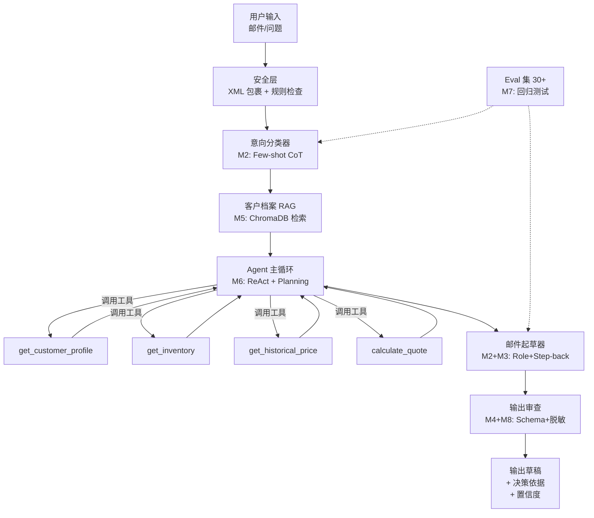
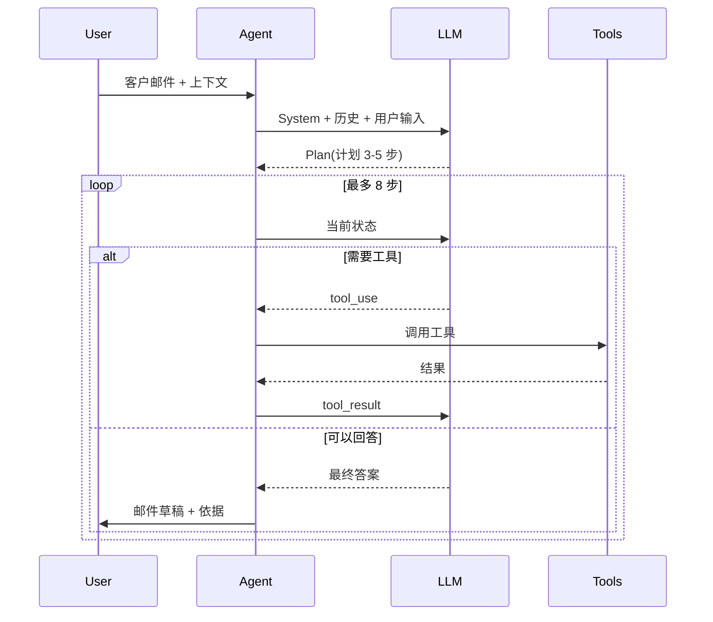
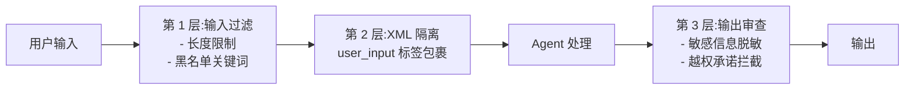
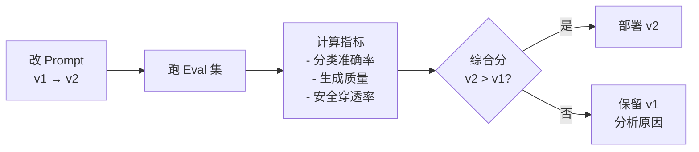

# 🏗 销售 Agent · 系统架构

---

## 🌊 数据流概览



---

## 📦 模块划分

```
sales-agent/
├── agent/
│   ├── __init__.py
│   ├── main.py              # 入口,组装各组件
│   ├── classifier.py        # 客户意向分级(M2)
│   ├── rag.py               # 客户档案 RAG(M5)
│   ├── tools.py             # Agent 工具定义 + mock(M6)
│   ├── drafter.py           # 邮件起草(M2+M3)
│   ├── reviewer.py          # 输出审查与脱敏(M4+M8)
│   ├── safety.py            # 安全规则 + Prompt 包裹(M8)
│   └── memory.py            # 多轮对话摘要压缩(M5)
├── prompts/
│   ├── system_rules.md      # <system_rules> 的内容
│   ├── classifier.md        # 分级 Prompt
│   ├── drafter_email.md     # 邮件起草 Prompt
│   └── ...
├── data/
│   ├── customers.json       # 客户档案(mock)
│   ├── inventory.json       # 库存(mock)
│   └── sales_history.json   # 历史成交(mock)
├── evals/
│   ├── golden_set.jsonl     # Eval 黄金样本
│   ├── run_eval.py          # 回归脚本
│   └── reports/             # 每版结果存档
├── tests/
│   ├── test_classifier.py
│   ├── test_agent.py
│   └── test_red_team.py
├── .env.example             # API key 示例
├── requirements.txt
└── README.md
```

---

## 🔁 Agent 主循环(ReAct)



---

## 🛡 安全防线(3 层)



---

## 📊 Eval 回归工作流



---

## 🎯 关键设计决策

### 为什么不直接让 Agent 发邮件?
**草稿 + 人工确认** 是最重要的设计。AI 再稳也要让人守门,尤其是对外沟通。永远留审阅步骤。

### 为什么客户档案用 RAG 而不是长上下文?
- 客户档案会无限增长,长上下文成本不可控
- RAG 更容易引用回溯
- 支持跨客户的横向查询

### 为什么意向分类和邮件起草分开?
- 单一职责,便于独立优化和评估
- 不同任务用不同模型(分类用 Haiku,起草用 Sonnet)省成本

### 为什么加 Eval?
没有 Eval,任何改动都是"感觉好像变好了"。Eval 是工程化的分水岭。

---

## ⚡ 性能 / 成本预期

| 维度 | 目标 |
|---|---|
| 端到端延迟 | 5-10s(含工具调用) |
| 单次对话 Token | ~3000 输入 + 1000 输出 |
| 单次成本(Sonnet) | ~$0.02-0.05 |
| 缓存后重复请求 | 0.5× 原成本 |

一天 50 次对话 = 约 $1-2.5 / 天 = $30-75 / 月。

---

## 🧠 选型建议

| 组件 | 推荐模型 | 理由 |
|---|---|---|
| 意向分类器 | Claude Haiku 4.x | 简单分类,便宜 |
| 邮件起草器 | Claude Sonnet 4.x | 中文好,推理稳 |
| Eval Judge | 换一个厂商(GPT-4.x) | 避免同源偏见 |
| Embedding(RAG) | bge-m3 / text-embedding-3-small | 中文支持好 |
